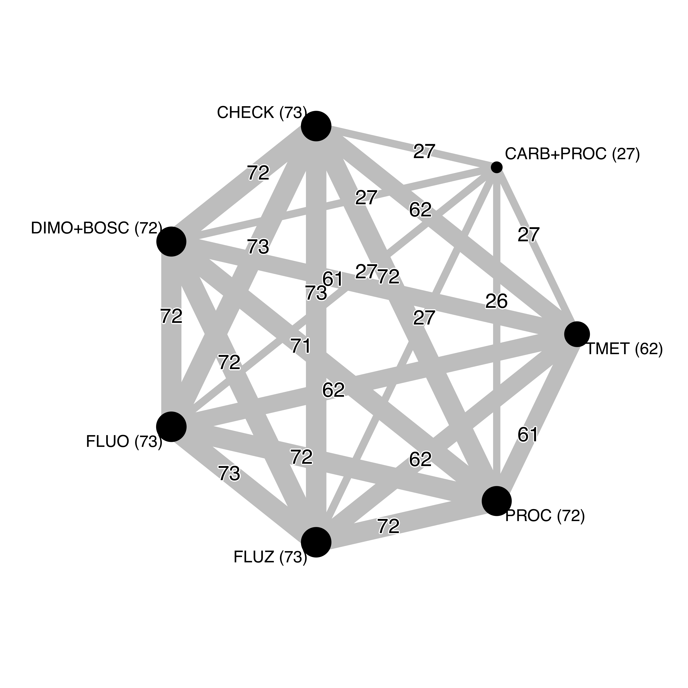

% About

 This website documents by describing in detail the data and all steps of the statistical analysis conducted for a research as a result of the study conducted by Jhonatan Paulo Barro, an M.Sc. student of the Graduate Program in Plant Pathology, under the guidance of Prof. Emerson Del Ponte, Universidade Federal de Viçosa.

The objective of this study was to use meta-analysis for summarizing percent control of white mold incidence and sclerotia mass by selected fungicides, as well as the yield response to the fungicides due to disease reduction. 
In addition, the economic benefits were explored using the mean and respective variances of the meta-analytic estimates of yield response to calculate the probability of breaking-even on costs for a range of scenarios of soybean prices and fungicide costs. 

The data were obtained from a large cooperative trial network for testing fungicide conducted in Brazil during ten years across several locations in Brazil. 

## Citation

Please cite this research compendium as:  

## Licences

Data: [CC-0](https://creativecommons.org/publicdomain/zero/1.0/) attribution requested in reuse
Manuscript: [CC-BY-4.0](https://creativecommons.org/licenses/by/4.0/)  
Code: [MIT](https://opensource.org/licenses/MIT) year: 2018, copyright holder: Emerson Del Ponte

