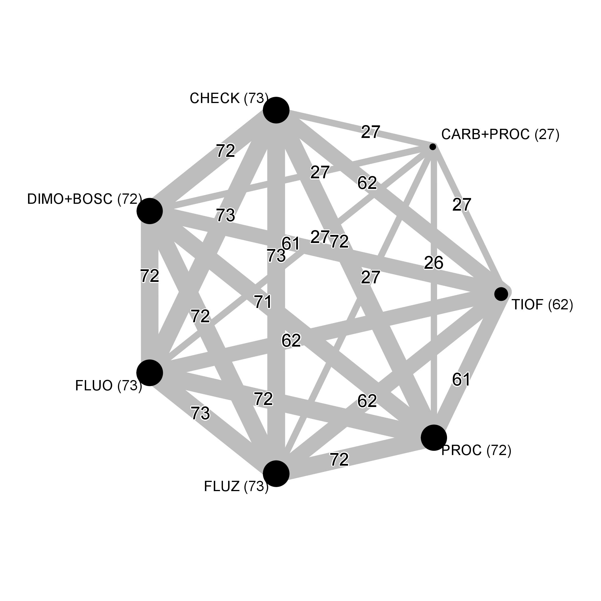

% About

 This website describes in details data and all steps of the statistical analysis for a study conducted by Jhonatan Paulo Barro, an M.Sc. student of the Graduate Program in Plant Pathology, under the supervision of Prof. Emerson Del Ponte, Universidade Federal de Viçosa.

The objective of the research was to summarize, using meta-analytic approaches, soybean yield response to some fungicides, which have been used to reduce incidence of white mold disease (caused by the fungus *Sclerotinia sclerotiorum*), evaluated during 10 years and multiple sites in Brazil. In addition, the economic benefits were explored using the mean and respective variances of the meta-analytic estimates of yield response to calculate the probability of breaking-even on costs for a range of scenarios of soybean prices and fungicide costs.  

## Citation

Please cite this research compendium as:  

## Licences

Data: [CC-0](https://creativecommons.org/publicdomain/zero/1.0/) attribution requested in reuse
Manuscript: [CC-BY-4.0](https://creativecommons.org/licenses/by/4.0/)  
Code: [MIT](https://opensource.org/licenses/MIT) year: 2018, copyright holder: Emerson Del Ponte

